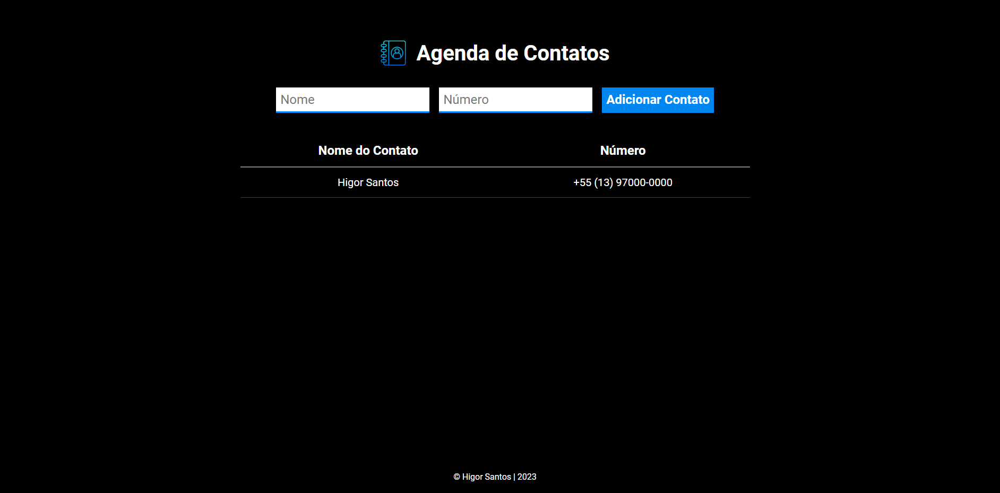

<h1 align="center">
  Agenda de Contatos
</h1>

## 📷 Deploy

<h3>LINK: https://agenda-contatos-wine.vercel.app/</h3>

## 💻 Projeto

Neste projeto próprio, consegui aplicar os conceitos de HTML, CSS e JavaScript para a criação de uma Agenda de Contatos, como projeto de conclusão de módulo na EBAC.

## 🚀 Tecnologias

- JavaScript
- HTML
- CSS

## 📔 Conhecimentos utilizados

- [x] Uso semântico do HTML
- [x] Uso do CSS Flexbox
- [x] Uso do DOM com JavaScript
- [x] Uso de Arrays com JavaScript
